# AI-DLC Workflows CDE：知识沉淀、记忆管理与 PoC Accelerator 可视化解读

本文从代码实现出发，解释 `aidlc-workflows-cde` 如何组织知识、记忆、状态、审计、产物和插件，并用 Mermaid 图展示核心运行链路。

> 结论先行：AI-DLC 当前不是“把所有内容塞进向量数据库”的 RAG 系统。它采用 **Markdown 文件作为可审计事实源 + 编译后的图作为运行计划 + 人工确认的学习晋升机制 + append-only 审计事件**。知识按路径装载，记忆按层解析，状态按 intent 隔离，插件在安装时 compose 到宿主框架。

## 1. 一张图理解全局

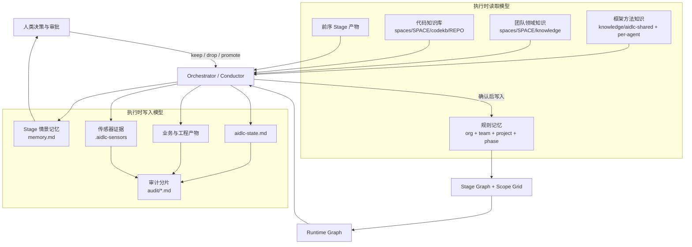

这个设计的关键不是“无限记住”，而是把信息分成不同寿命和不同权威等级。

## 2. 六类信息不要混淆

| 类型 | 回答的问题 | 主要位置 | 生命周期 | 是否自动进入长期上下文 |
|---|---|---|---|---|
| 方法知识 | 应该怎样做 | `<harness>/knowledge/` | 随框架版本 | 是，按共享知识和 agent 知识装载 |
| 团队知识 | 我们这里怎样做、领域事实是什么 | `aidlc/spaces/<space>/knowledge/` | 跨 intent、空间级持久 | 是，按共享目录和 agent 目录装载 |
| 规则记忆 | 本组织、团队、项目已经确认了什么实践 | `aidlc/spaces/<space>/memory/` | 跨 intent、空间级持久 | 是，严格加法解析 |
| Stage 情景记忆 | 这一次执行中做过哪些解释、偏离、权衡 | `<intent>/<phase>/<stage>/memory.md` | intent 内永久留档 | 否；先在学习仪式中筛选 |
| 运行状态 | 现在走到哪、下一步是什么 | `<intent>/aidlc-state.md` | 当前 intent | 是，恢复和路由的权威状态 |
| 审计事实 | 谁在何时做了什么 | `<intent>/audit/*.md` | append-only | 不作为方法知识；用于验证、恢复和去重 |

### 核心原则

1. **知识与状态分离**：知识描述“怎么做”，状态描述“做到哪”。
2. **候选学习与长期规则分离**：`memory.md` 中的内容不会自动污染长期规则。
3. **空间与意图分离**：space 保存团队可复用资产，intent 保存一次需求的执行记录。
4. **事实与推断分离**：CodeKB 和 Knowledge Plugin 强调源码锚点、验证状态和人工签字。
5. **运行图与源码分离**：stage Markdown 是作者源；编译图是运行时消费面。

## 3. 文件系统与生命周期架构

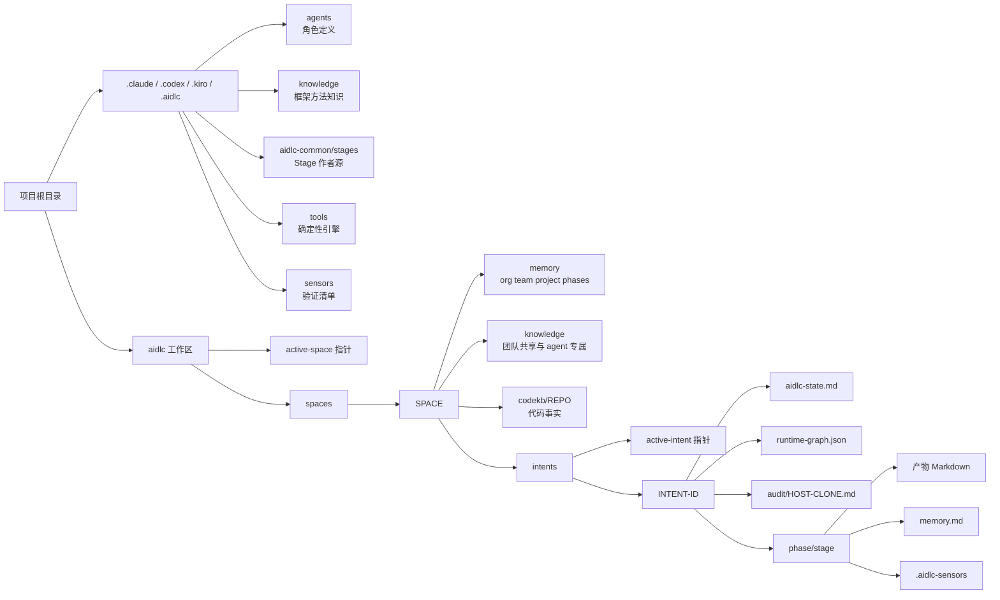

### Space 是长期知识边界

- `active-space` 决定当前团队/业务域。
- `memory/`、`knowledge/`、`codekb/` 都属于 space，因此多个 intent 共享。
- `org.md → team.md → project.md → phases/<phase>.md` 形成严格加法规则链。
- 这里的“严格加法”不是 CSS 式覆盖：每个适用文件都会进入 `rules_in_context`，不会因为下层存在而丢弃上层。

### Intent 是一次需求的可恢复执行记录

- `active-intent` 指向当前需求记录。
- 每个 intent 有独立 `aidlc-state.md`、`runtime-graph.json`、审计、stage 产物和 `memory.md`。
- 切换 intent 不会丢失旧记录；恢复时重新读取状态和图。

对应实现入口：

- 路径与 active cursor：`core/tools/aidlc-lib.ts`
- workspace/intent 创建：`core/tools/aidlc-utility.ts`
- 规则目录解析：`core/tools/aidlc-graph.ts`
- runtime graph：`core/tools/aidlc-runtime.ts`

## 4. 知识如何进入一次 Stage

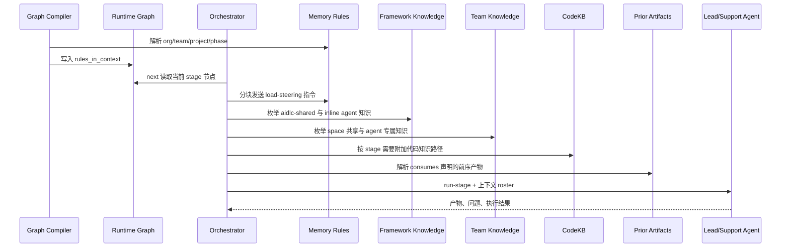

### 代码里的真实装载逻辑

`core/tools/aidlc-orchestrate.ts` 的 `inlineContextEntries()` 会：

1. 根据 stage 的 `mode` 决定哪些 agent 在 conductor 内联执行。
2. 加入 agent persona：`agents/<agent>.md`。
3. 加入框架共享知识：`knowledge/aidlc-shared/**/*.md`。
4. 加入框架 agent 知识：`knowledge/<agent>/**/*.md`。
5. 加入 space 共享知识：`aidlc/spaces/<space>/knowledge/aidlc-shared/**/*.md`。
6. 加入 space agent 知识：`aidlc/spaces/<space>/knowledge/<agent>/**/*.md`。
7. 去重并受 transport byte budget 约束；超出的路径会产生 warning，而不是静默假装已加载。

当前实现是 **path-loaded knowledge**。源码注释明确把检索层称为未来能力，因此不要把它理解成已有 embedding、向量召回或自动语义检索。

## 5. 记忆沉淀的核心闭环

### 5.1 Stage 内先记录“情景记忆”

每个 stage 在启动时维护自己的 `memory.md`，固定四类：

- Interpretations：对模糊描述所做的解释。
- Deviations：有意识偏离 stage 指南的地方。
- Tradeoffs：备选方案与取舍。
- Open questions：待确认问题。

这相当于一次执行的 episodic memory，不直接成为团队规范。

### 5.2 Gate 前执行学习仪式

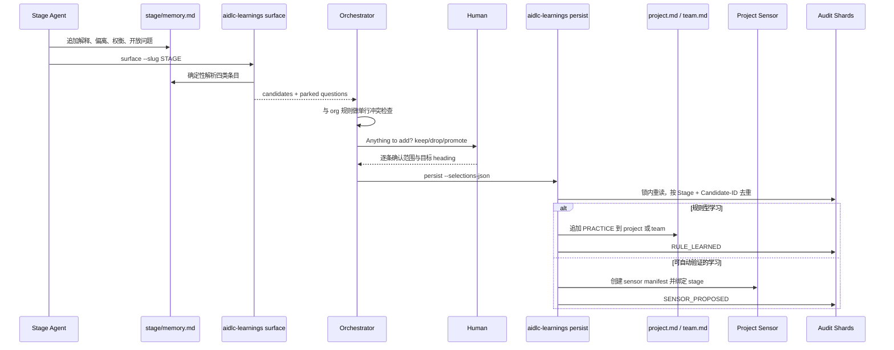

### 5.3 为什么这个闭环安全

- **LLM 不直接写长期记忆**：`surface` 只读取和结构化候选。
- **人类做价值判断**：keep/drop、project/team 范围、是否转成 sensor 都必须确认。
- **确定性 writer 落盘**：`persist` 才执行实际写入。
- **锁内去重**：写入前重新读取 audit，并用 `(Stage, Candidate-ID)` 去重。
- **审计可追踪**：规则和 sensor 分别发出 `RULE_LEARNED`、`SENSOR_PROPOSED`。
- **开放问题不自动晋升**：它们被 parked，避免把未知事项误写成规则。

对应代码：`core/tools/aidlc-learnings.ts`、`core/knowledge/aidlc-shared/memory-template.md`、`core/aidlc-common/protocols/stage-protocol.md`。

## 6. 状态、审计与会话恢复

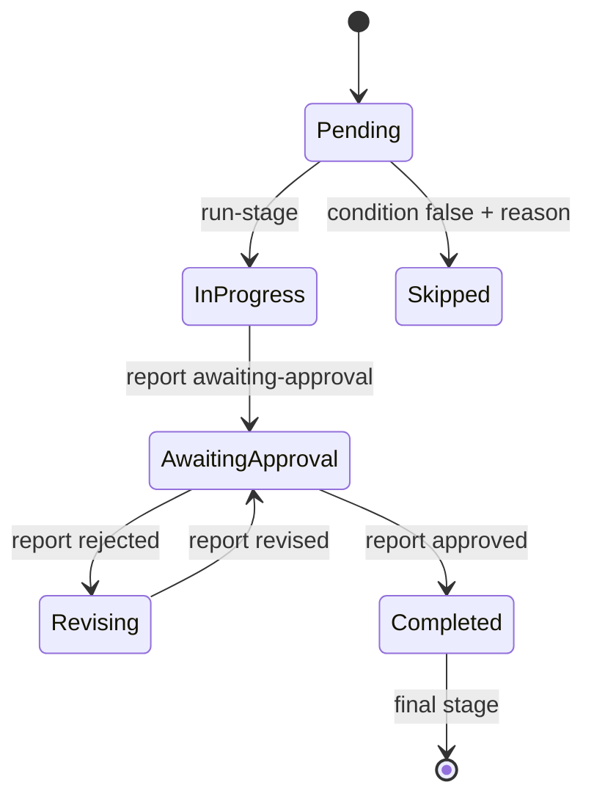

`aidlc-state.md` 是当前 intent 的权威位置，主要包含：

- scope、项目类型、workspace 识别结果；
- phase 和 stage checkbox；
- Current Stage、Next Stage、Last Completed Stage；
- Revision Count、Construction Autonomy Mode；
- Session Resume Point。

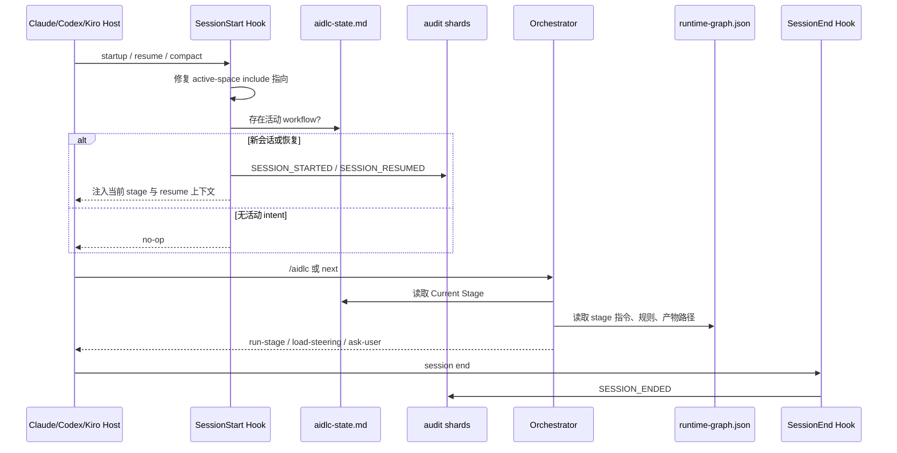

### 审计不是日志装饰，而是并发和恢复协议的一部分

- 每个 host/clone 写自己的审计分片，降低多 worktree 并发冲突。
- artifact create/update hook 自动发出 `ARTIFACT_CREATED` / `ARTIFACT_UPDATED`。
- learning writer 在 audit lock 内去重。
- revision、approval、sensor、review、swarm 等事件都可由状态工具回放和验证。
- hook 失败采用 fail-open，但会写 hooks health drop，`doctor` 可见。

## 7. 编译图和运行图的分工

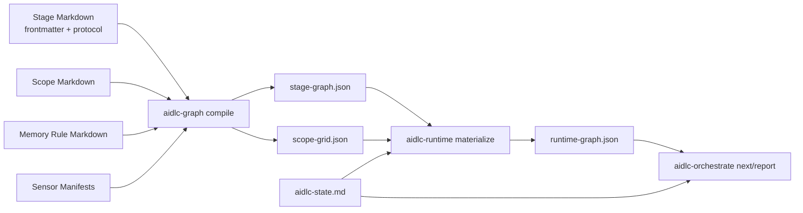

- `stage-graph.json`：框架级编译结果，包含 stage 元数据、依赖、`rules_in_context` 和 `sensors_applicable`。
- `scope-grid.json`：每个 scope 选择哪些 stage。
- `runtime-graph.json`：某个 intent 的具体执行图，补齐 artifact path、`memory_path`、gate、workspace/worktree 等运行信息。
- `aidlc-state.md`：执行游标；图回答“可以怎样走”，状态回答“现在走到哪”。

## 8. 可选 Knowledge Plugin：更深的知识工程飞轮

核心框架已经具备 memory/knowledge/codekb 分层。`plugins/knowledge-plugin` 在此基础上增强棕地知识质量。

```mermaid
flowchart LR
    Source[棕地源码 + 文档]
    Bootstrap[knowledge-plugin-bootstrap]
    AIReady[.ai-ready<br/>DDD 文档 + code-intel]
    Verify[锚点/断言/引用<br/>fail-closed 校验]
    Senior[Senior 人工签字]
    Adapter[aidlc-codekb-adapter]
    CodeKB[9 文件 CodeKB 契约]
    Downstream[RE / Design / Build stages]
    Gate[Gate 驳回与 stage learnings]
    KEM[IMPROVEMENT.md<br/>KEM-lite entries]

    Source --> Bootstrap --> AIReady --> Verify --> Senior --> Adapter --> CodeKB --> Downstream
    Downstream --> Gate --> KEM
    KEM -->|下次重跑吸收| Bootstrap
```

### KEM-lite 的本质

它把一条知识当成可寻址对象，包含来源、锚点、验证状态、决策和时间。门禁驳回或 stage learning 不直接改写生成文档，而是追加到 `IMPROVEMENT.md`；下一次 reverse-engineering 重新生成时吸收这些 entry，再由 adapter 输出稳定的 CodeKB 文件契约。

这形成：**源码事实 → 深度模型 → 人工确认 → 稳定 CodeKB → 下游消费 → 反馈 entry → 再生成**。

## 9. 插件是怎样进入核心运行图的

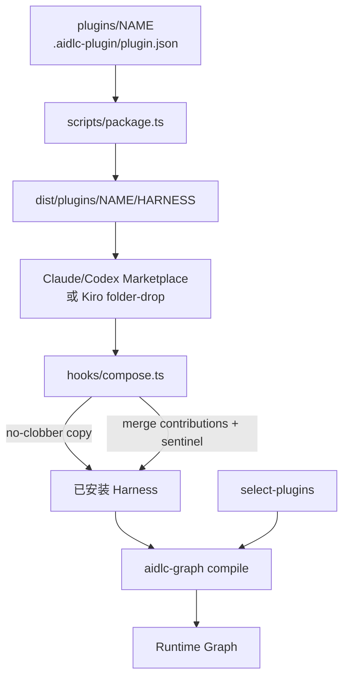

Compose 的主要护栏：

- stage、scope、agent、knowledge、sensor、tool 采用 no-clobber copy；冲突会 drop-log。
- contribution 对核心 stage 的结构和 prose 合并带 sentinel 与内容 hash，可幂等重跑和升级。
- 只有插件处于 enabled selection 时才把 contribution 焊入核心 stage。
- compose 后重新编译 graph；失败写 retry marker 和 health drop，不把失败伪装成成功。
- `plugin-contrib-<key>.json` 记录实际合入内容，使禁用插件时能剥离 contribution。

## 10. PoC Accelerator 插件架构

`plugins/poc-accelerator` 不是核心 `poc` scope 的别名。它定义独立的 `poc-accelerator-cde` scope，目标是客户可见、CDK-first、可演示、可交接的 PoC。

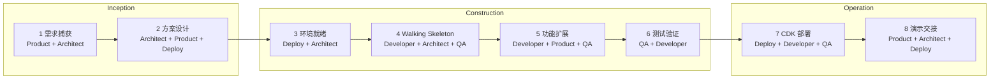

### 八步产物链

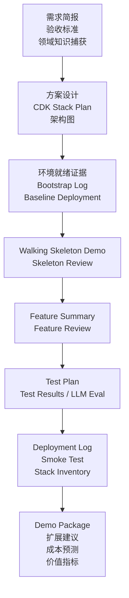

### 它与一次性技术 spike 的区别

| 维度 | 核心 `poc` | `poc-accelerator-cde` |
|---|---|---|
| 目标 | 快速验证可行性 | 客户可见交付 |
| 基础设施 | 可轻量 | TypeScript CDK 强制 |
| 部署证据 | 不一定 | 必须有 bootstrap、deployment、smoke evidence |
| 测试 | 最小验证 | 可重复测试；LLM 行为需要 eval 集 |
| 收尾 | 可丢弃 spike | Demo package、交接清单、成本和价值指标 |
| 生产声明 | 不适用 | 明确不静默宣称 production-ready |

## 11. PoC Step 1 的团队知识预检

PoC 插件最重要的知识护栏位于第一步：不能因为没有找到团队知识就静默继续。

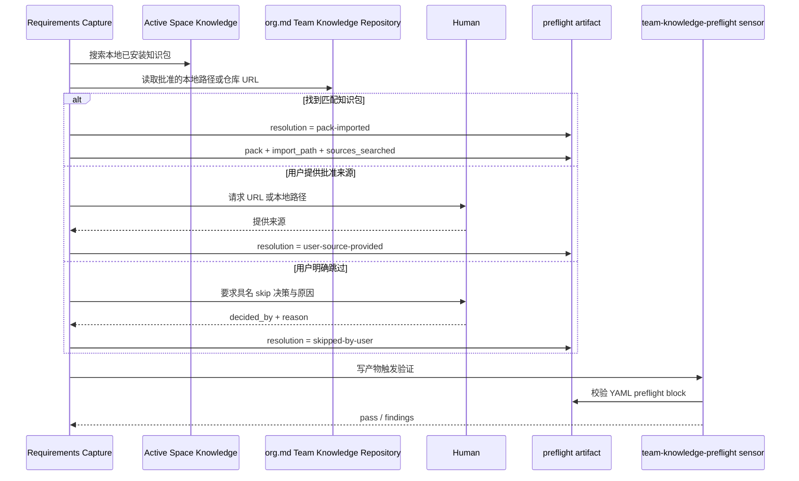

Sensor 强制验证：

- `resolution` 只能是 `pack-imported`、`user-source-provided`、`skipped-by-user`。
- `sources_searched` 不得为空。
- 导入知识包必须记录 `pack` 和 `import_path`。
- 用户来源必须记录 `source`。
- 跳过必须记录 `decided_by` 和 `reason`。
- “没有记录”不等于“用户同意跳过”。

对应文件：

- `plugins/poc-accelerator/stages/inception/poc-accelerator-step-01-requirements-capture.md`
- `plugins/poc-accelerator/sensors/aidlc-poc-accelerator-team-knowledge-preflight.md`
- `plugins/poc-accelerator/tools/aidlc-sensor-poc-accelerator-team-knowledge-preflight.ts`

## 12. PoC Accelerator 与核心记忆系统怎样协同

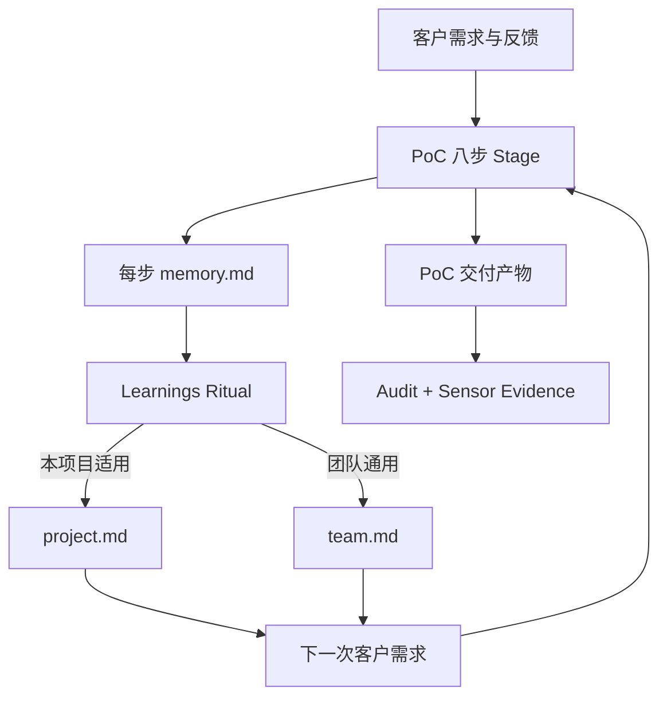

例如：

- 某客户账号需要固定 bootstrap qualifier：本项目特例，进入 `project.md`。
- 所有客户演示都必须使用合成数据：团队通用，进入 `team.md`。
- 每次部署后都必须验证某个 deterministic 条件：适合晋升为 project sensor。
- 某次临时 AWS 服务故障：保留在该 stage `memory.md` 和 audit，不应晋升为长期规范。

## 13. 推荐的理解顺序

如果你准备继续读代码，建议按以下顺序：

1. `core/aidlc-common/conductor.md`：总调度契约。
2. `core/aidlc-common/protocols/stage-protocol.md`：每个 stage 的原子仪式。
3. `core/tools/aidlc-graph.ts`：作者源如何编译成图。
4. `core/tools/aidlc-runtime.ts`：图如何物化到具体 intent。
5. `core/tools/aidlc-orchestrate.ts`：`next/report` 如何路由。
6. `core/tools/aidlc-state.ts`：状态迁移。
7. `core/tools/aidlc-learnings.ts`：学习晋升。
8. `core/tools/aidlc-lib.ts`：space、intent、路径、锁、审计基础设施。
9. `scripts/plugin-hooks-template/compose.ts`：插件如何安全合入。
10. `plugins/poc-accelerator/`：客户交付型 PoC 的具体实现。

## 14. 最简心智模型

```text
框架知识告诉 Agent “专业上应该怎么做”
团队知识告诉 Agent “我们这里的事实和约定是什么”
规则记忆告诉 Orchestrator “已经确认必须怎样做”
Stage memory 记录 “这次为什么这样做”
State 记录 “现在做到哪里”
Audit 证明 “实际发生过什么”
Artifacts 保存 “最终交付了什么”
Learnings Ritual 决定 “哪些经验值得进入下一次”
```

这套架构的核心价值是：**让 AI 获得连续性，但不让未经确认的模型推断自动变成组织真相。**
